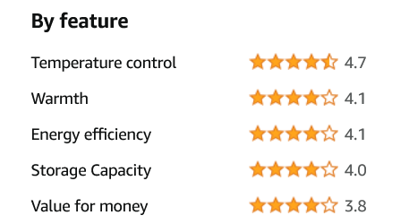

# Module - 1 | Mini Project

## Tweet analysis using **Twitter API** and **TextBlob**

Sentiment analysis is one tool in Artificial Intelligence that helps determine the emotion in a statement. It is particularly helpful in finding out the sentiment associated with a particular product, brand or service based on customer feedback. This helps businesses to further enhance their products or services.

A common usecase is analysing film reviews and product feedbacks on ecommerce websites.

*The rating of a refrigrator's features from Amazon.in. The rating has been given based on sentiment analysis*

The sentiment of a sentance is either classified as negative, neutral or positive and a polarity is associated with each sentence. The polarity ranges from -1 to +1 where 0 represents neutral sentiment.

In this project, you will have to do analysis on tweets from various users on Twitter related to a particular topic (keyword).

Don't panic. This is a lot easier than you think. The tweets will be supplied by the [Twitter's official API](https://developer.twitter.com/en/products/twitter-api). The analysis part will be done by [TextBlob](https://textblob.readthedocs.io/en/dev/) - a library that provides an easy to use interface to a complex model.

This project will ultimately help you get familiarize with third-party libraries and APIs.

An API (Application Programming Interface) is just something that helps our program communicate with someone else's program. Here in our case, our program needs some tweets related to a particular topic and that is supplied to us by a search program that Twitter runs.

You can use an external library called [tweepy](https://docs.tweepy.org/en/latest/) to send requests and take responses from Twitter API.

## Where should I start?

If you are a Twitter user, login and [apply for a developer account](https://developer.twitter.com/en/apply-for-access). Once approved you would be able to create an API access token and key. With those credentials you are authenticated to use the API.

Install `tweepy` and `textblob` after reading the documentation.

Follow these steps:

- Select you keyword to search.
- Set the number of tweets you want to analyse.
- Authenticate with your `consumer_key`, `consumer_token`, `access_key` and `access_token`.
- Fetch the tweets.
- If the tweets contain unwanted texts, emojis and links, then clean them using regular expression (python has a built-in library for regular expression - `re`).
- Find the polarity of each tweet.
- Finally, find the average polarity and display the final result in percentage.

That's it! You can upload this project to you GitHub account and send us the link. Remember to hide your credentials when you upload to GitHub.