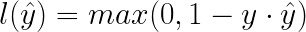

# PoW - 12 **Hinge Loss**

Hinge loss is a loss function used for training classifiers most notably for support vector machines (SVMs).

For an intended output y and predicted output ŷ, the hinge loss for the prediction ŷ is defined as:

For each value of the predicted outputs and the actual outputs, develop a logic to find the hinge loss and then return the sum of the losses.

#### Prerequisites
---
- NumPy
- Loss functions